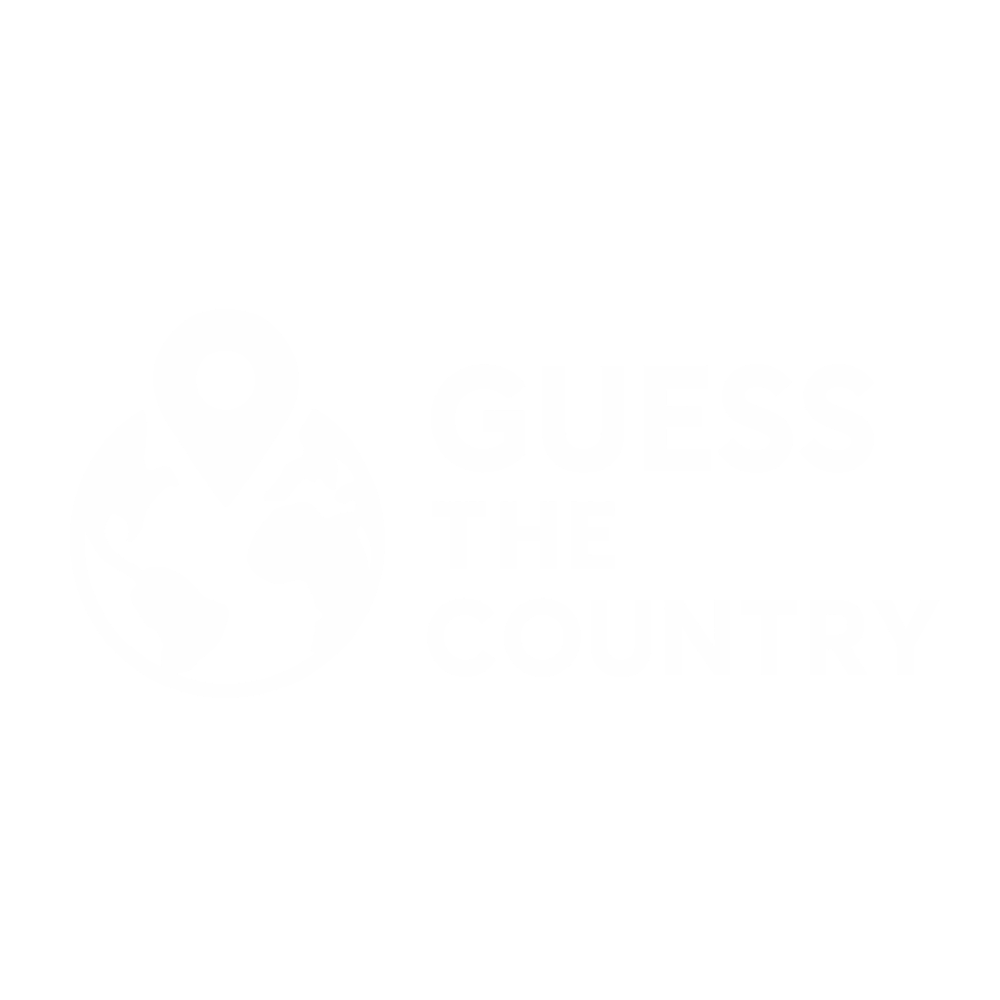

<p align="center">
  
</p>

<p align="center">
  Um jogo interativo para aprendizado geográfico, criado com Mapbox e Vue.js
</p>

## PREVIEW

## SOBRE

Guess the Country é um jogo educativo onde os jogadores precisam adivinhar o nome de países ao redor do mundo. O jogo apresenta um globo interativo 3D usando a biblioteca Mapbox GL, destacando um país aleatório que o jogador deve identificar e assim ganhar pontos.

## COMO JOGAR

1. Inicie o jogo e insira seu apelido
2. Um país será destacado no globo
3. Digite o nome do país no campo de resposta
4. Acerte para ganhar pontos e avançar para o próximo país
5. Tente acertar o máximo de países possível!

## STACK

- Front-End
  - Vue 3 w/ Vite, Tailwind, Nuxt UI
  - Mapbox GL

## RODANDO O PROJETO

- OBS: É necessário ter uma conta <a href="https://www.mapbox.com/">Mapbox</a> e obter uma chave de API para utilizá-la no projeto.
- Para rodar o projeto, você pode rodar localmente ou através do Docker:
    - #### Rodando localmente
    - 
        ```bash
        # Clonar o projeto
        git clone https://github.com/iamThiagoo/guess-the-country-mapbox.git

        # Entrar no diretório
        cd guess-the-country-mapbox

        # Instalar as dependências
        npm install --legacy-peer-deps

        # Configurar as variáveis de ambiente
        cp .env.example .env

        # Iniciar o projeto
        npm run dev
        ```
    - #### Rodando com Docker
        - Docker ainda não disponível

## LICENSE

[MIT](./LICENSE)
