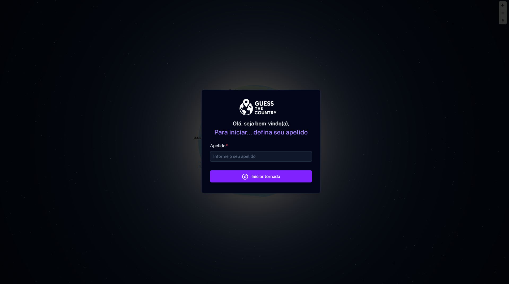
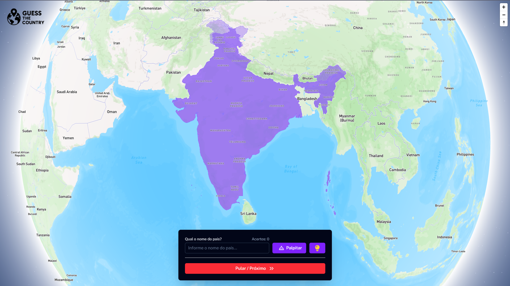

<div align="center">
    
</div>
<br>
<p align="center"> Um jogo interativo para aprendizado geográfico, criado com Mapbox e Vue.js <p>
<p align="center"> <a href="https://guess-the-country-mapbox.vercel.app/">https://guess-the-country-mapbox.vercel.app/</a> <p>

## PREVIEW

<div style="display: flex; gap: 10px; margin-top: 10px;">
  
  
</div>

## SOBRE

Guess the Country é um jogo educativo onde os jogadores precisam adivinhar o nome de países ao redor do mundo. O jogo apresenta um globo interativo 3D usando a biblioteca Mapbox GL, destacando um país aleatório que o jogador deve identificar e assim ganhar pontos.

## COMO JOGAR

1. Inicie o jogo e insira seu apelido
2. Um país será destacado no globo
3. Digite o nome do país no campo de resposta
4. Acerte para ganhar pontos e avançar para o próximo país
5. Tente acertar o máximo de países possível!

## STACK

- Vue 3 w/ Vite, Tailwind, Nuxt UI
- Mapbox GL

## RODANDO O PROJETO

- OBS: É necessário ter uma conta <a href="https://www.mapbox.com/">Mapbox</a> e obter uma chave de API para utilizá-la no projeto. Necessário limitar o uso da sua API para o domínio do projeto se for rodar em produção.
- Para rodar o projeto, você pode rodar localmente ou através do Docker:
  - #### Rodando localmente
  - ```bash
    # Clonar o projeto
    git clone https://github.com/iamThiagoo/guess-the-country-mapbox.git

    # Entrar no diretório
    cd guess-the-country-mapbox

    # Instalar as dependências
    npm install --legacy-peer-deps

    # Configurar as variáveis de ambiente
    cp .env.example .env

    # Iniciar o projeto
    npm run dev

    # Acessar o projeto
    http://localhost:5173
    ```

  - #### Rodando com Docker
  - ```bash
    # Clonar o projeto
    git clone https://github.com/iamThiagoo/guess-the-country-mapbox.git

    # Configurar as variáveis de ambiente
    cp .env.example .env

    # Iniciar o projeto
    docker-compose up -d

    # Acessar o projeto
    http://localhost:5173
    ```

## LICENSE

[MIT](./LICENSE)
